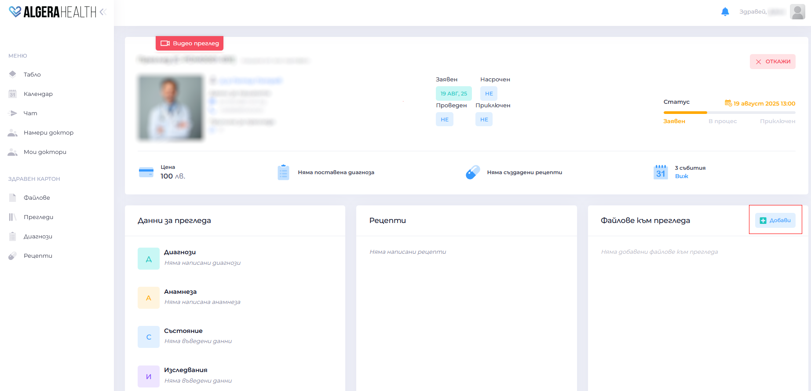
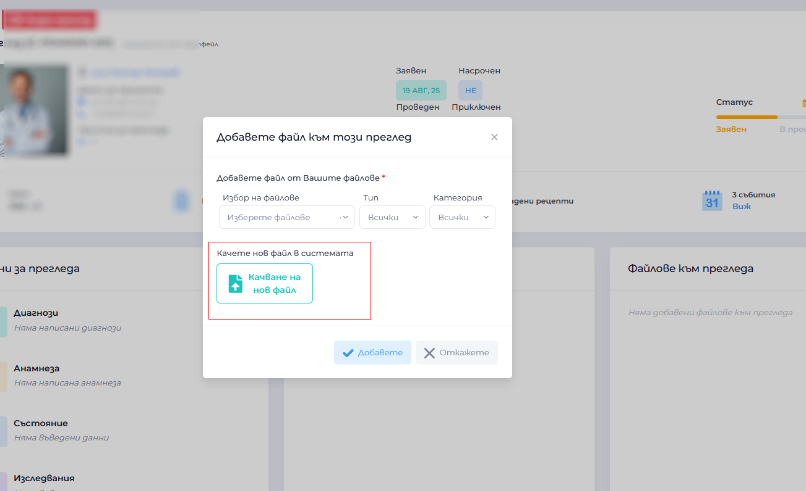

# How to attach a file to a medical examination

[Вижте тази страница на български](https://manual.algerahealth.com/kak-da-prikacha-fayl-kam-pregled)

1. Open the examination dashboard
1. Go to "Файлове към прегледа (Files for review)"
1. Click the button "Добави (Add)"
   
1. Select a document/photo from your device
   
1. Wait for confirmation that the upload was successful
  - Example: You can attach research results, previous epicrisis reports or photos
