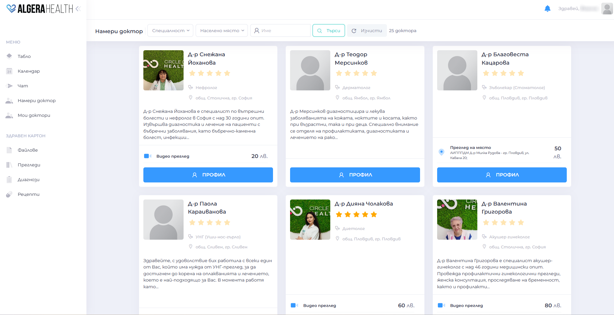
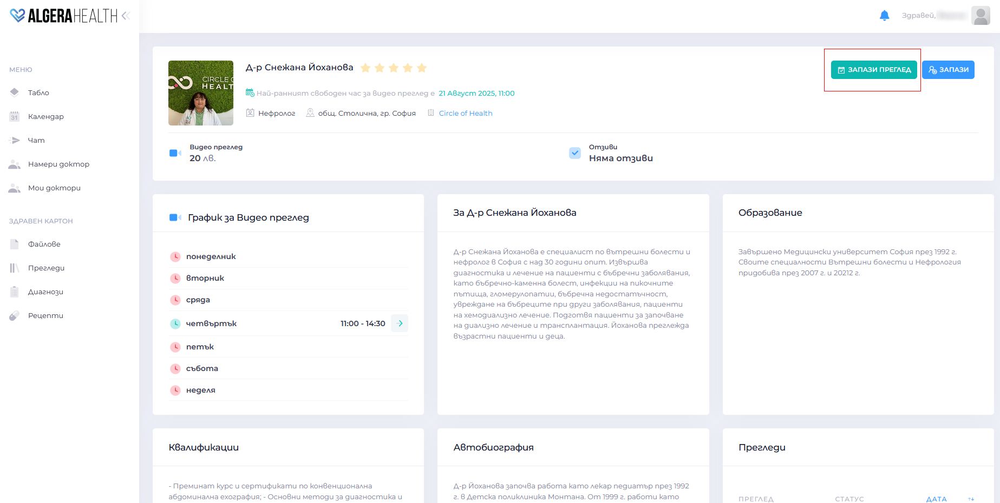
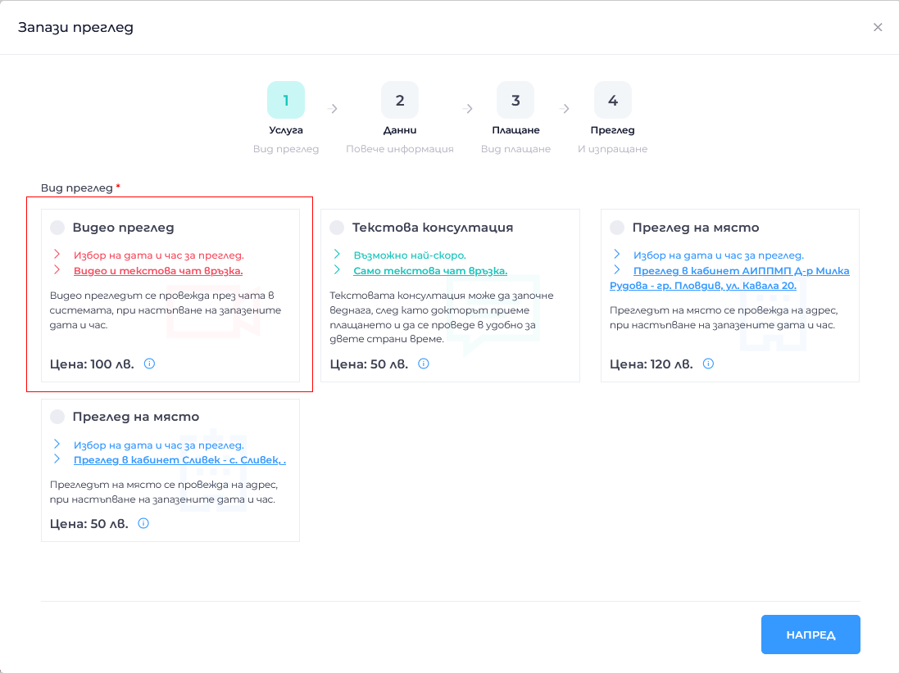
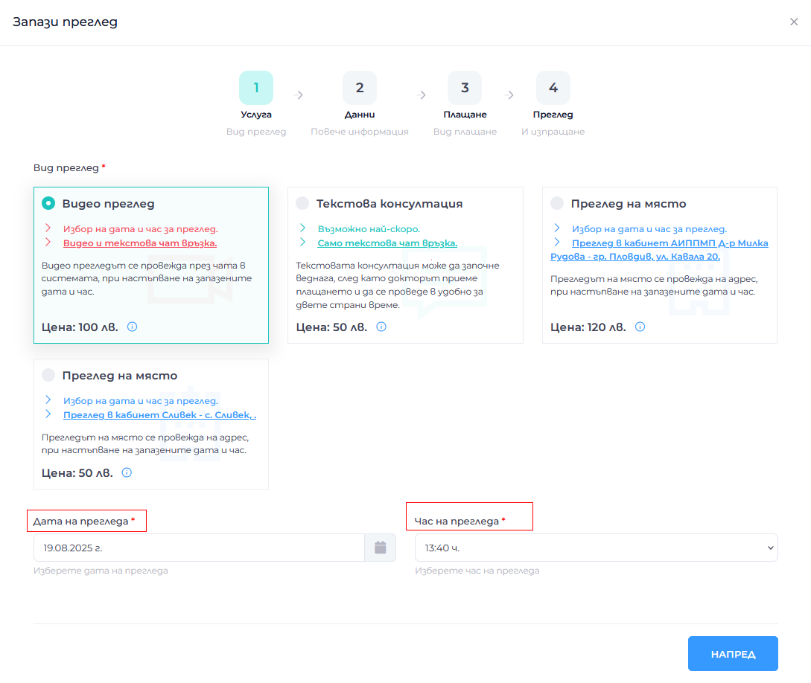
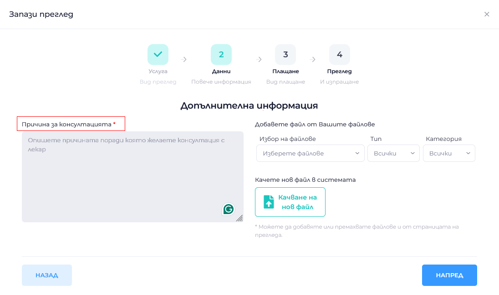
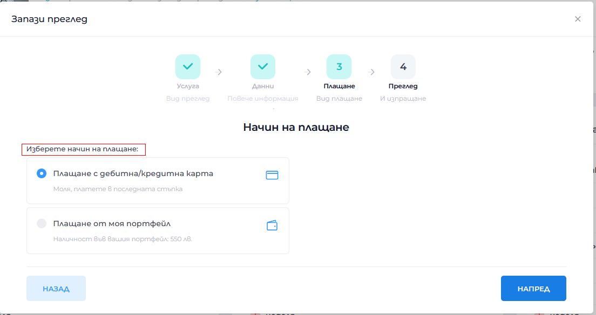
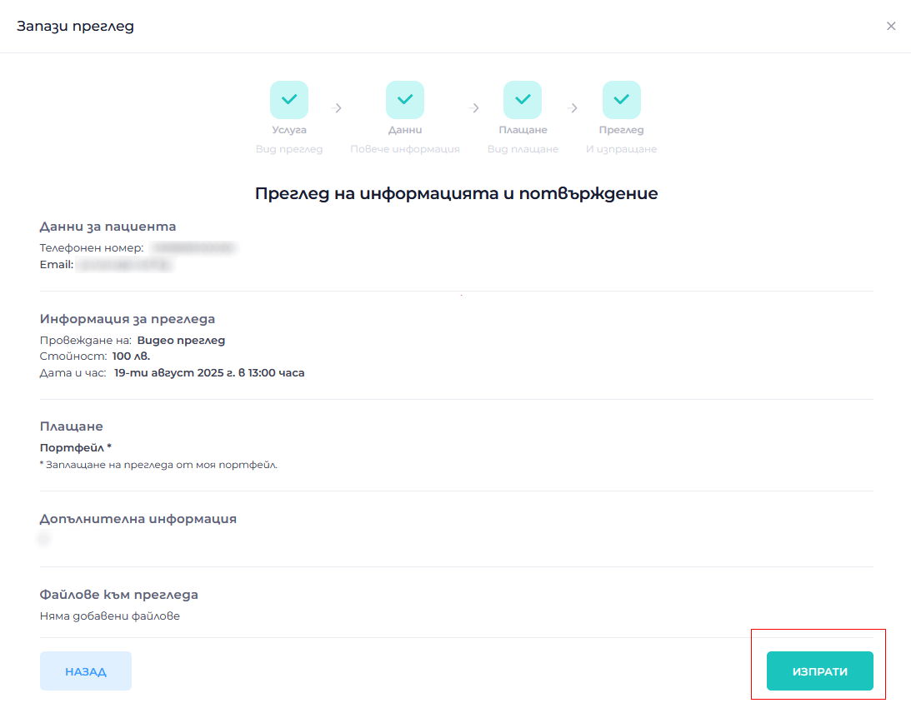
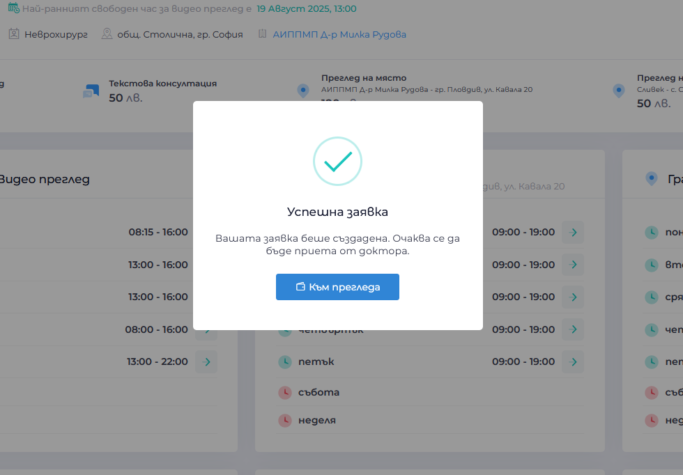
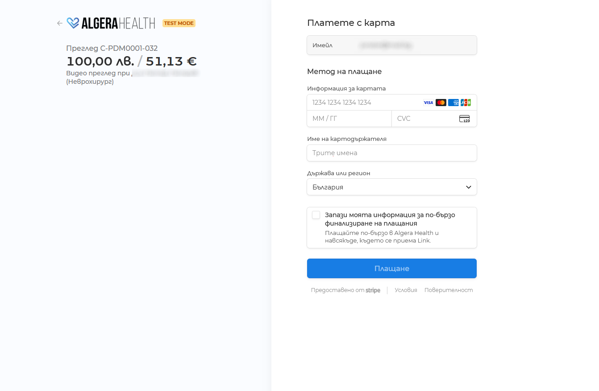

# How to book an appointment with a doctor

[Вижте тази страница на български](https://manual.algerahealth.com/kak-da-zapazya-pregled-pri-doktor)

A guide to the process from request to conducting of a medical examination.

1. Types of consultations
- Online Video consultation/review – [more information](https://algerahealth.com/%d0%b2%d1%8a%d0%b7%d0%bc%d0%be%d0%b6%d0%bd%d0%be%d1%81%d1%82%d0%b8/%d0%be%d0%bd%d0%bb%d0%b0%d0%b9%d0%bd-%d0%bf%d1%80%d0%b5%d0%b3%d0%bb%d0%b5%d0%b4/)
- Online Text consultation – [more information](https://algerahealth.com/%d0%b2%d1%8a%d0%b7%d0%bc%d0%be%d0%b6%d0%bd%d0%be%d1%81%d1%82%d0%b8/%d1%82%d0%b5%d0%ba%d1%81%d1%82%d0%be%d0%b2%d0%b0-%d0%ba%d0%be%d0%bd%d1%81%d1%83%d0%bb%d1%82%d0%b0%d1%86%d0%b8%d1%8f/)
- On-site review/examination in the doctor's office – [more information](https://algerahealth.com/%d0%b2%d1%8a%d0%b7%d0%bc%d0%be%d0%b6%d0%bd%d0%be%d1%81%d1%82%d0%b8/%d0%bf%d1%80%d0%b5%d0%b3%d0%bb%d0%b5%d0%b4-%d0%bd%d0%b0-%d0%bc%d1%8f%d1%81%d1%82%d0%be/)

1. How to book a consultation
- [Login to your profile](https://manual.algerahealth.com/en/login)
- Open "Find a doctor" or "My doctors" (if you have already visited this doctor)
  

1. In the profile of the selected doctor, click the button "Запази преглед (Save review)"
   

1. **Step 1**: Select the desired type of consultation (Video review / Text consultation / On-site review)
   

1. **Step 2**: Select the desired date and time for the review
   

1. **Step 3**: Fill in the Reason for the consultation. You can attach a file if desired
   

1. **Step 4**: Choose a payment method
   

1. **Step 5**: Review all review information and click "Изпрати (Send)"
   

1. You will receive a confirmation on your screen and a notification in your email
   

1. Pay with a card or from your personal wallet
   

1. The doctor must accept your request for the examination and the examination to be conducted
