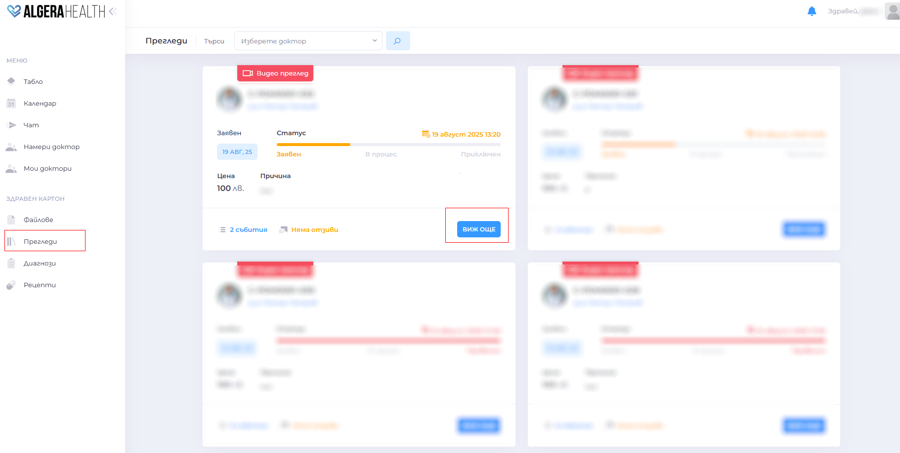
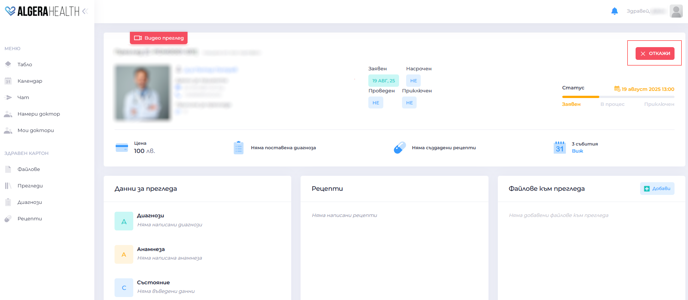
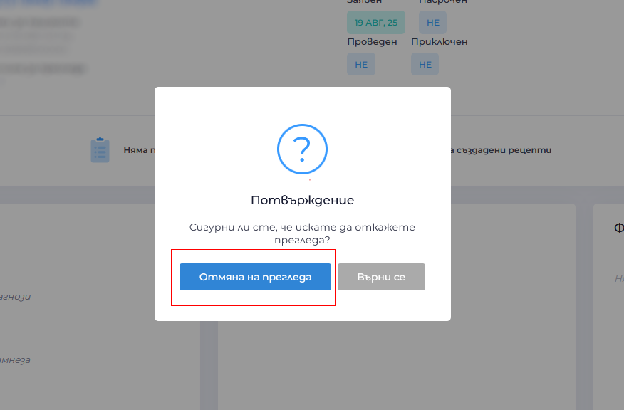

# How to cancel a medical examination

[Вижте тази страница на български](https://manual.algerahealth.com/kak-da-otkazha-pregled)

1. Click on menu "Прегледи (Reviews)"

1. Select the examination you want to cancel
   

1. Click "Откажи (Cancel)"
   

1. Confirm the action in the pop-up window
   

1. You will receive a message about the cancellation and possible refund (according to the cancellation policy)
>  **Important**: If the doctor rejects the request (or you cancel at least 24 hours before the scheduled appointment for video and on-site visits), the previously blocked amount will be refunded to your wallet.  
