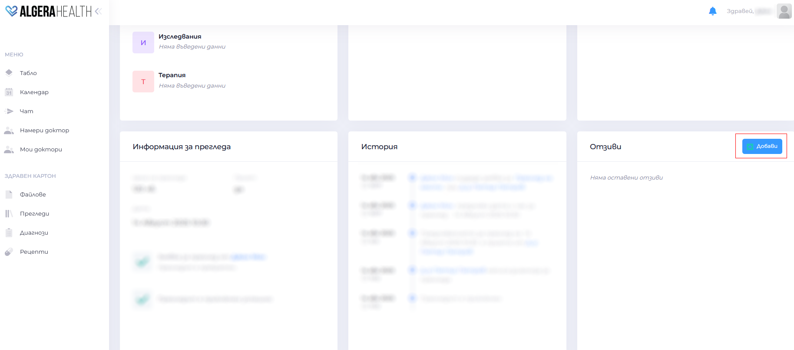
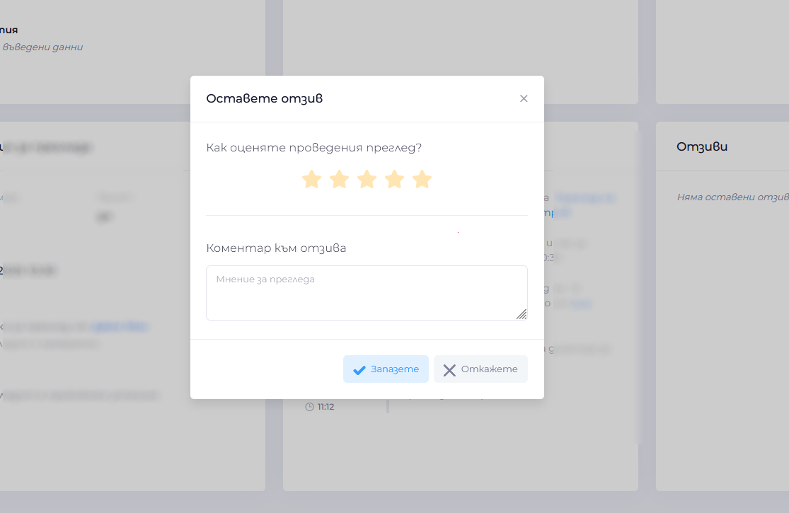

# How to leave feedback on a medical examination

[Вижте тази страница на български](https://manual.algerahealth.com/kak-da-ostavya-otziv-kam-pregled)

1. Once the examination is complete, you will receive a notification that you can leave a review
1. Open "Прегледи (Reviews)", and click on the successfully completed examination
1. In the Отзиви (Reviews) section click the button "Добави (Add)"
   
1. Fill in a rating (stars) and write a comment about the specialist
   
1. Confirm with the button "Запазете (Save)"
