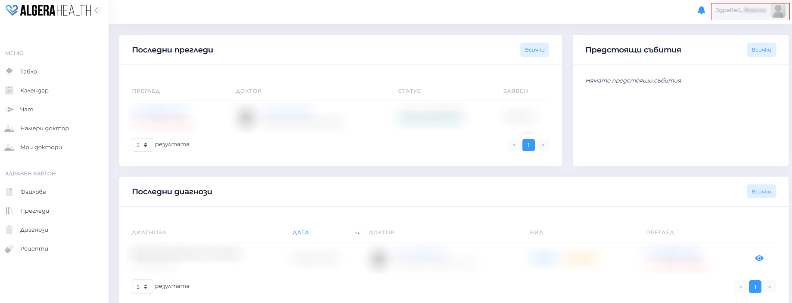
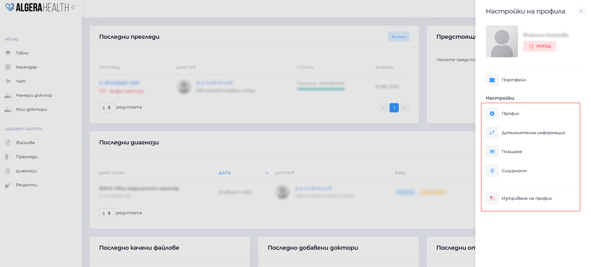

# Profile

[Вижте тази страница на български](https://manual.algerahealth.com/profil)

The "Account Settings" section allows you to manage your personal information.

It consists of several sections.

1. Profile
- View and edit names, email, personal identification number, phone number, city, address and profile photo
- Save the changes with the "Запази (Save)" button

1. Additional information
- Add other additional information

1. Security
- Change password

1. Deactivate account
    - Select "Изтриване на профил (Delete account)"
    - Confirm the action
>   **Warning**: deletion is irreversible
