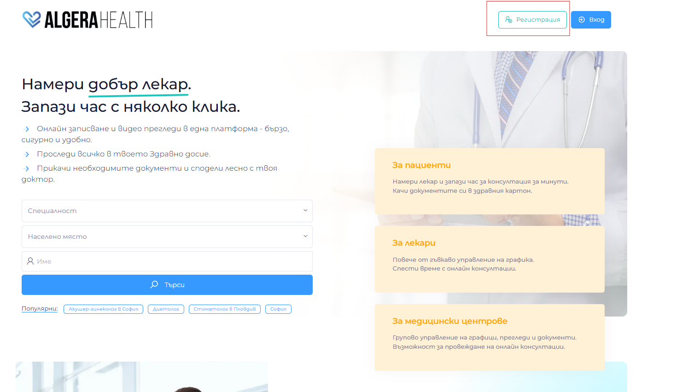
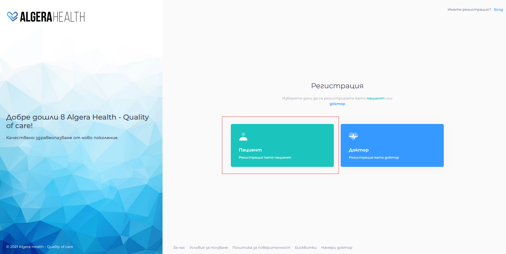
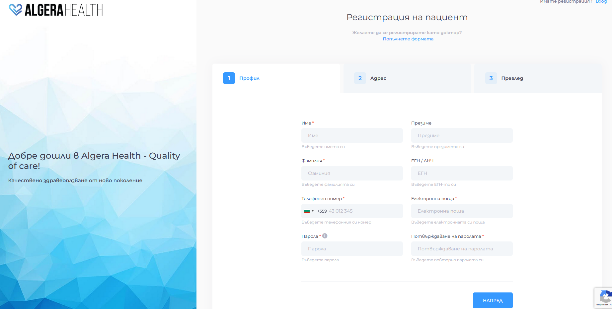

# Registration

[Вижте тази страница на български](https://manual.algerahealth.com/registratsiya)

1. Visit the website [app.algerahealth.com](https://app.algerahealth.com)
1. Click the button "Регистрация" (Registration)
   
1. Select "Регистрация като пациент" (Register as a Patient)
   
1. Fill in the fields (required fields are marked with an asterisk)
- The password must be between 10 and 60 characters long and contain at least one Latin letter and at least one special character: "@", "!", "#", "$", etc.
  
1. Accept the terms of use and click "Регистрирай се (Register)"
1. Check your email (the one you specified in the email address field when registering) and confirm your registration via the link sent
