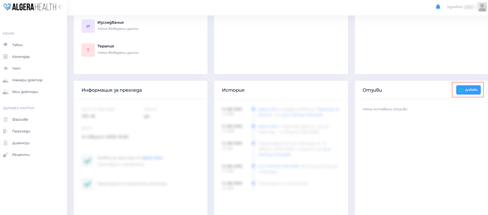
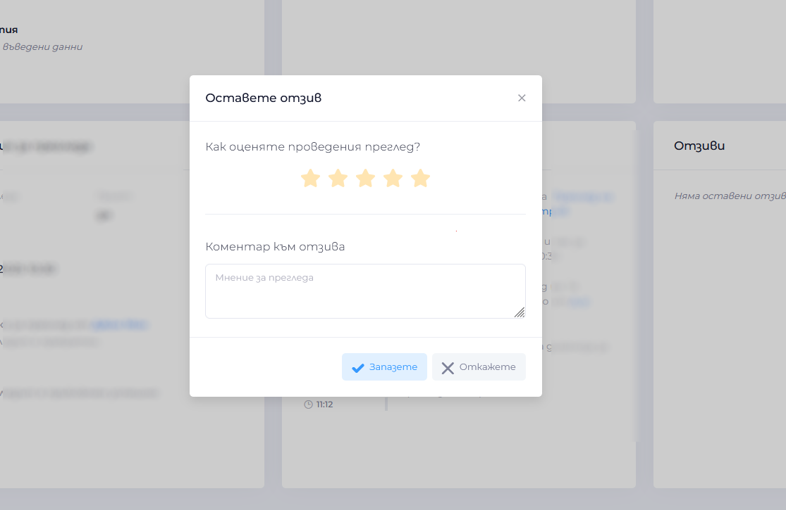

# Как да оставя отзив към преглед

1. След приключване на прегледа ще получите известие, че можете да оставите отзив.
1. Отворете "Моите прегледи", изберете успешно приключения преглед.
1. Натиснете "Остави отзив".
  
1. Попълнете рейтинг (звезди) и напишете коментар за специалиста.
  
1. Потвърдете с "Изпрати".
