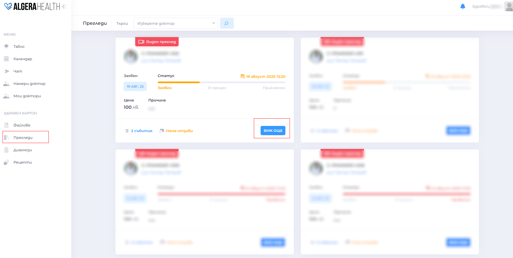
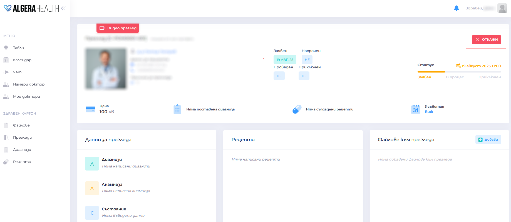
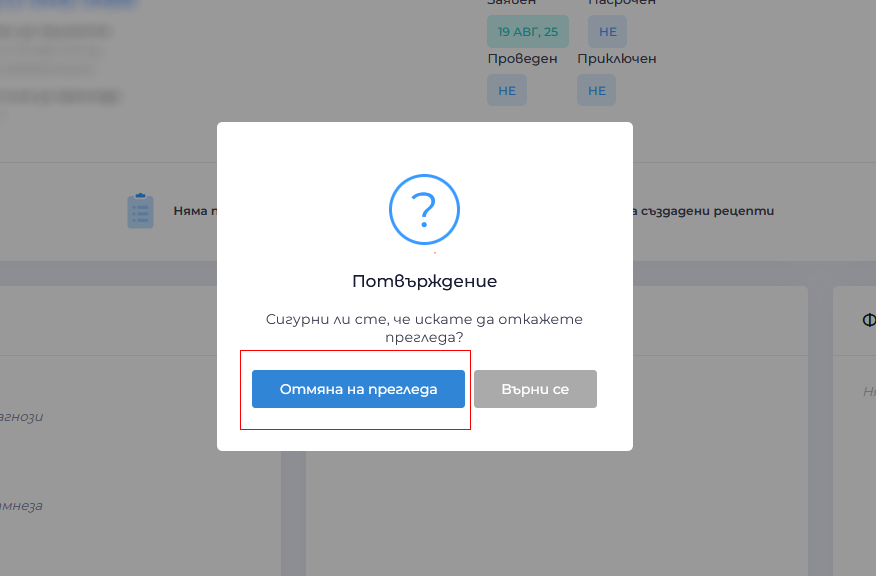

# Как да откажа преглед

1. Влезте в меню "Прегледи"

1. Изберете прегледа, който искате да отмените
  

1. Натиснете "Откажи"
  

1. Потвърдете действието в изскачащия прозорец
  

1. Ще получите съобщение за отмяната и евентуално възстановяване на сумата (според правилата за анулиране).
  >  **Важно**: При отхвърляне от страна на доктора (или отказ от ваша страна поне 24 часа преди запазения час при видео преглед и преглед на място), предварително блокираната сума се възстановява в портфейла Ви. 
