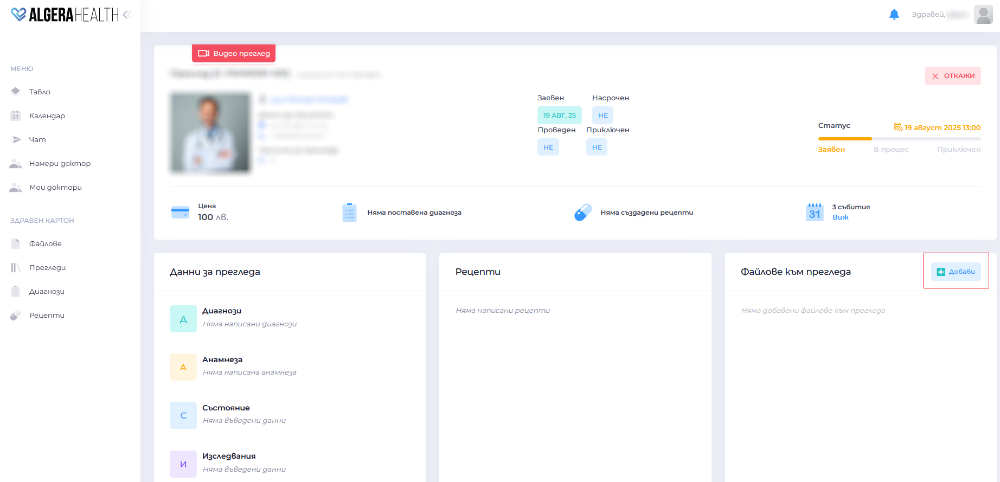

# Как да прикача файл към преглед

1. Отворете Таблото на прегледа.
1. Отидете на "Файлове към прегледа".
1. Натиснете бутона "Добави".
  
1. Изберете документ/снимка от устройството си.
  
1. Изчакайте потвърждение, че качването е успешно. 
  - Пример: Можете да прикачите резултати от изследвания, предишни епикризи или снимки.
