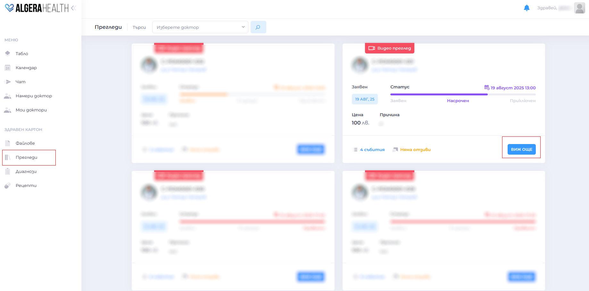
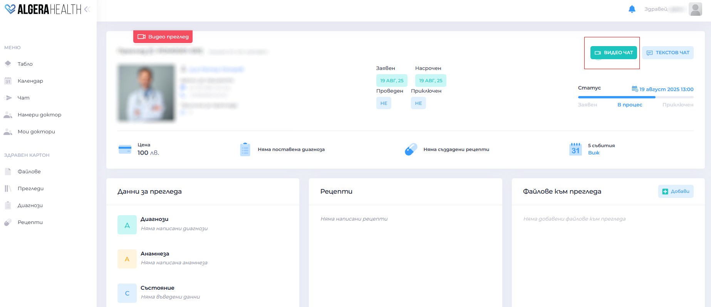
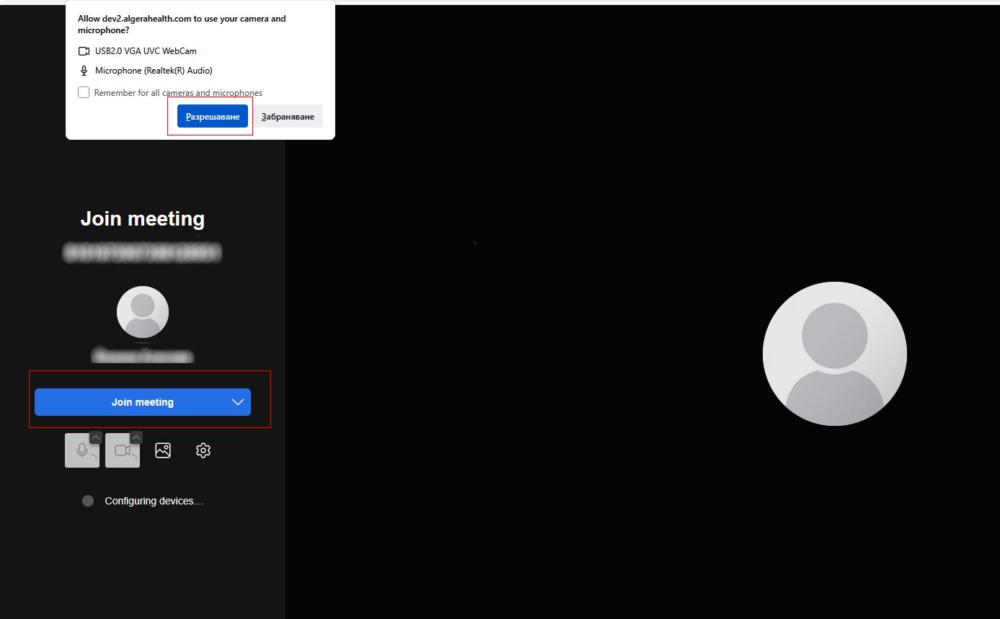

# Как да проведа преглед

1. За Онлайн Видео консултация:
  - [Влезте](https://manual.algerahealth.com/vhod) в профила си поне 5 минути преди началото. 
  - Отворете "Прегледи" и намерете запазения час.
    
  - След като настъпи часът натиснете бутона "Видео чат" – ще се отвори видео чат с доктора.
    
  - Уверете се, че камерата и микрофонът ви са включени. Разрешете достъпа до тях и натиснете бутона "Join meeting"
    

1. За Онлайн Текстова консултация:
  - Веднага след като специалистът приеме консултацията, можете да започнете да пишете в чата.

1. За присъствен преглед:
  - Отидете на посочения адрес навреме.
  - Носете личен документ и нужните медицински документи (или прикачи техни дигитални копия към прегледа в Algera Health).
