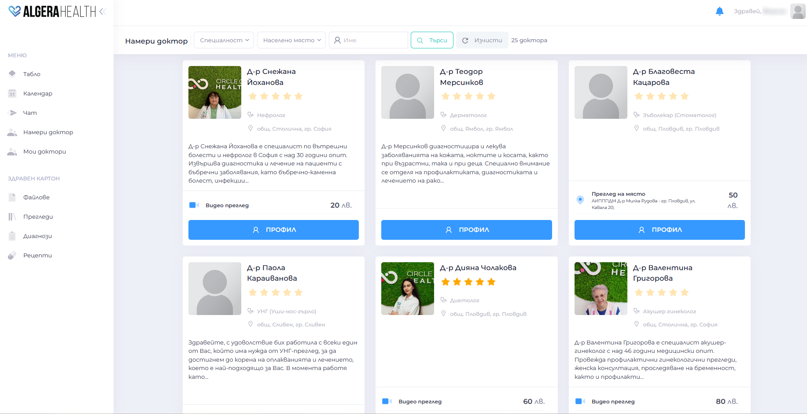
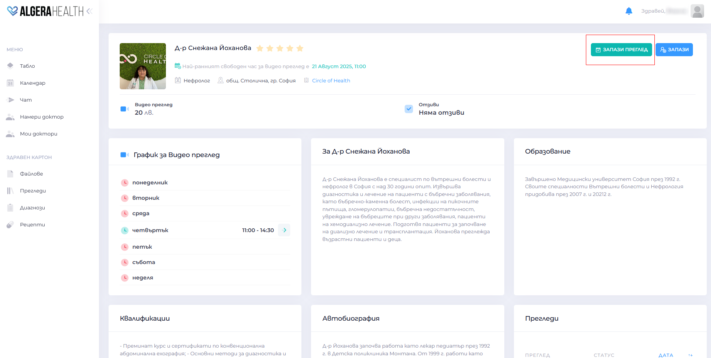
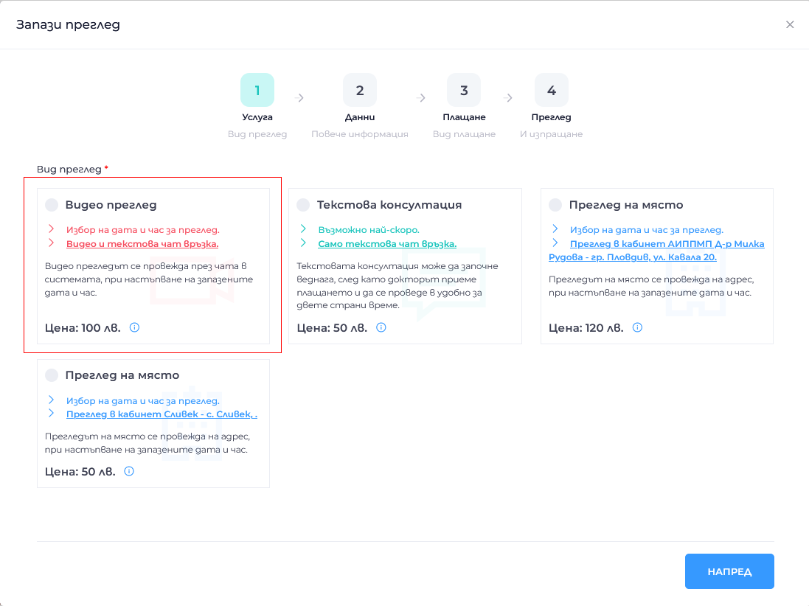
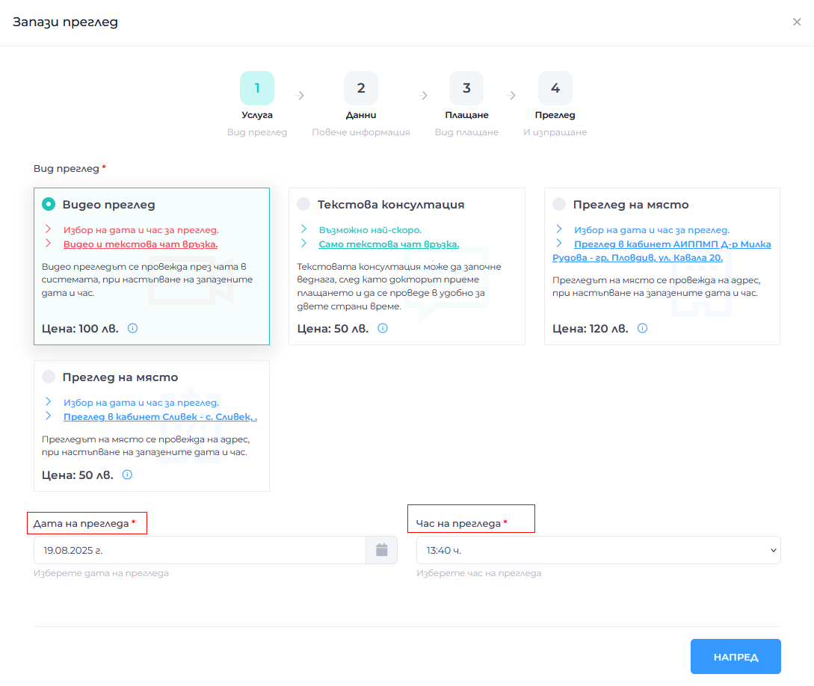
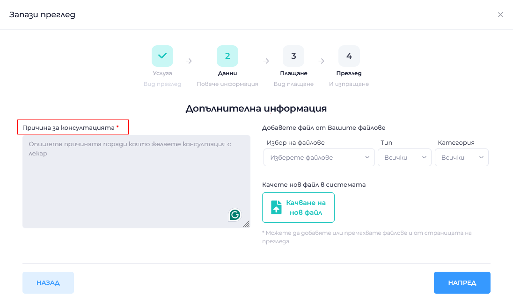
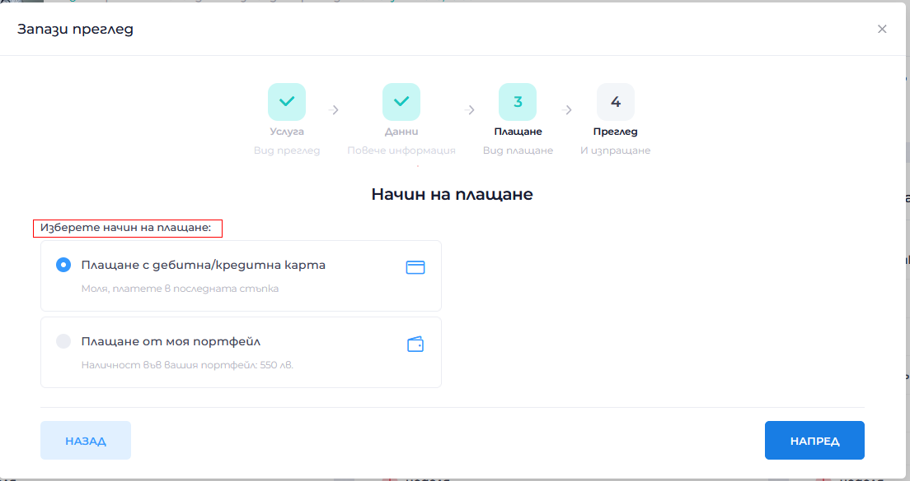
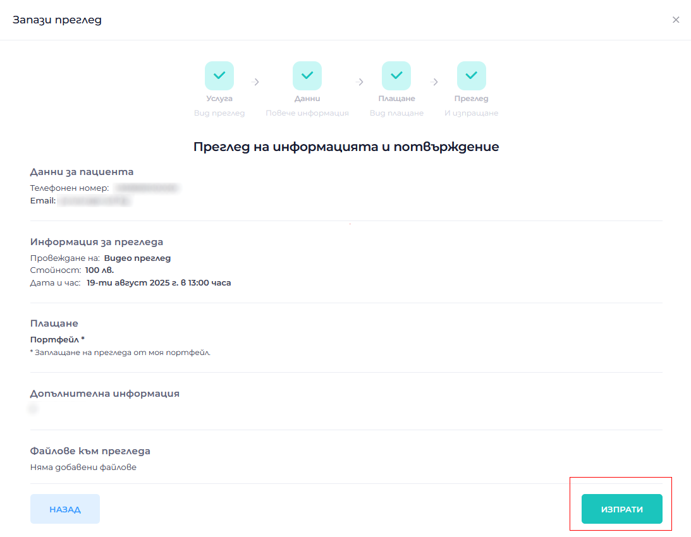
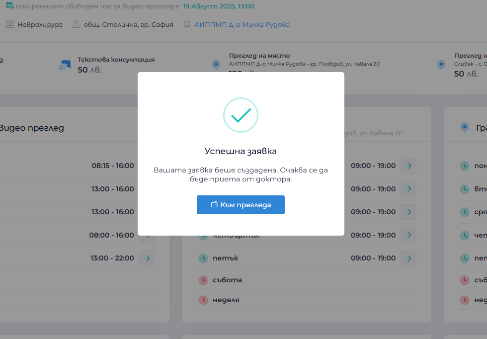

# Как да запазя преглед при доктор

Ръководство за процеса от заявка до провеждане на преглед.

1. Видове прегледи 
  - Онлайн Видео консултация – [повече информация](https://algerahealth.com/%d0%b2%d1%8a%d0%b7%d0%bc%d0%be%d0%b6%d0%bd%d0%be%d1%81%d1%82%d0%b8/%d0%be%d0%bd%d0%bb%d0%b0%d0%b9%d0%bd-%d0%bf%d1%80%d0%b5%d0%b3%d0%bb%d0%b5%d0%b4/)
  - Онлайн Текстова консултация – [повече информация](https://algerahealth.com/%d0%b2%d1%8a%d0%b7%d0%bc%d0%be%d0%b6%d0%bd%d0%be%d1%81%d1%82%d0%b8/%d1%82%d0%b5%d0%ba%d1%81%d1%82%d0%be%d0%b2%d0%b0-%d0%ba%d0%be%d0%bd%d1%81%d1%83%d0%bb%d1%82%d0%b0%d1%86%d0%b8%d1%8f/)
  - Преглед в кабинет на доктора – [повече информация](https://algerahealth.com/%d0%b2%d1%8a%d0%b7%d0%bc%d0%be%d0%b6%d0%bd%d0%be%d1%81%d1%82%d0%b8/%d0%bf%d1%80%d0%b5%d0%b3%d0%bb%d0%b5%d0%b4-%d0%bd%d0%b0-%d0%bc%d1%8f%d1%81%d1%82%d0%be/)

1. Как да заявите преглед 
  - [Влезте в профила си](https://manual.algerahealth.com/vhod)
  - Отворете "Намери доктор" или "Мои доктори" (ако вече сте посещавали този доктор)
  

1. В профила на избрания доктор натиснете "Запази преглед".
  
   
1. **Стъпка 1**: Изберете желан тип преглед (Видео консултация / Текстова консултация / Преглед на място).
  

1. **Стъпка 2**: Изберете желаната дата и час за провеждане на прегледа.
  
   
1. **Стъпка 3**: Попълнете Причина за консултацията. При желание можете да прикачите файл.
  

1. **Стъпка 4**: Изберете начин на плащане.
  

1. **Стъпка 5**: Прегледайте цялата информация за прегледа и натиснете "Изпрати".
  

1. Ще получите потвърждение на екрана и известие в имейла си
  

1. Платете с карта или от личния портфейл
  

1. Следва докторът да приеме вашата заявка за прегледа
