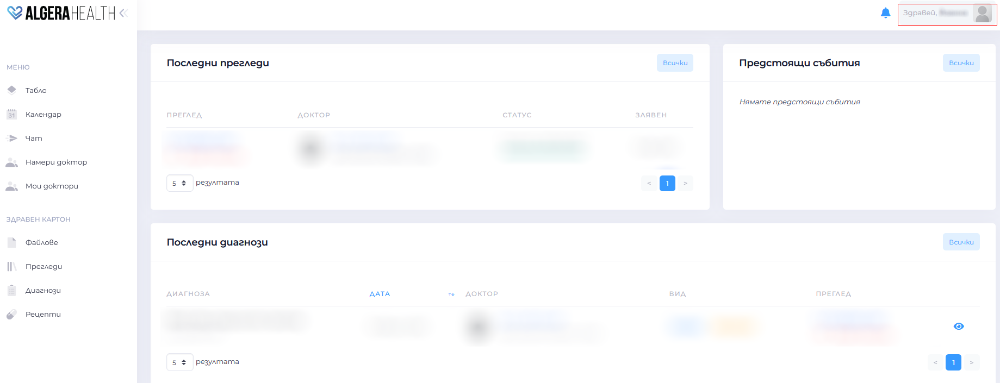
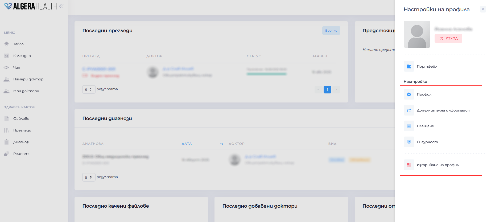

# Профил

Разделът "Настройки на профила" позволява управление на личната ви информация.

Той се състои от няколко раздела.

1. Профил
  - Преглед и редакция на имена, имейл, ЕГН, телефон, населено място, адрес и снимка на профила
  - Запазете промените с бутона "Запази"

1. Допълнителна информация
  - Добавяне на друга допълнителна информация

1. Сигурност
  - Промяна на парола

1. Деактивиране на профил 
   - Изберете "Изтриване на профил"
   - Потвърдете действието
  >   **Внимание**: изтриването е необратимо
