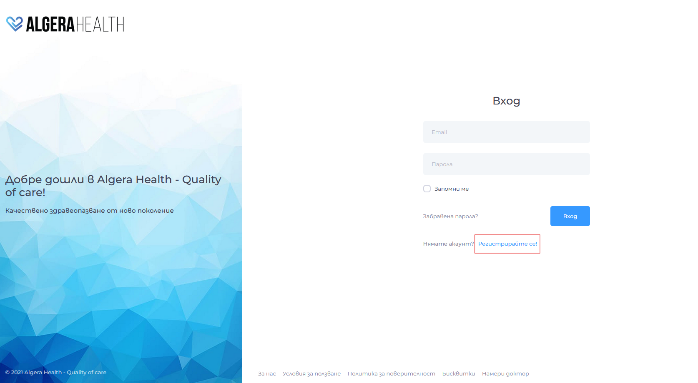
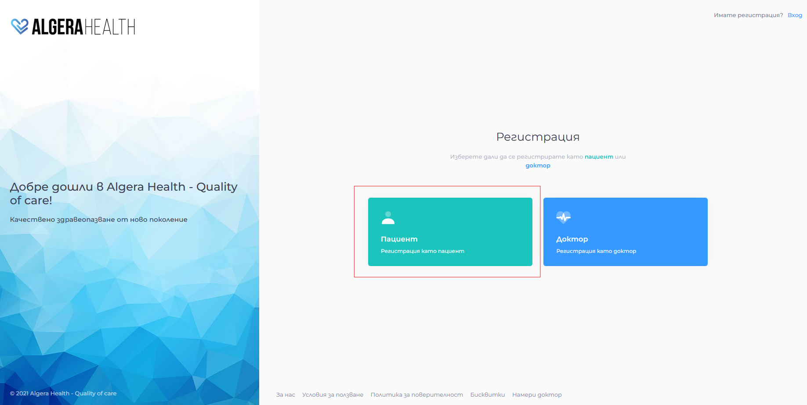
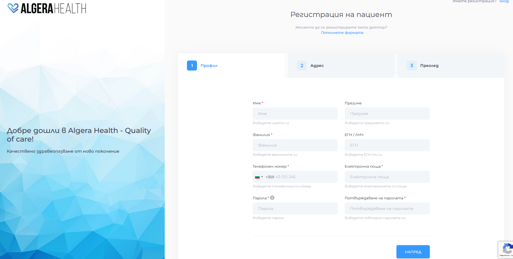

# Регистрация

1. Отворете [app.algerahealth.com](https://app.algerahealth.com)
1. Натиснете линка "Регистрирайте се!" под панела за вход.
  
1. Изберете "Регистрация като пациент"
  
1. Попълнете полетата (задължителните полета са отбелязани със звезда)
  - Паролата трябва да е между 10 и 60 символа и да съдържа поне една латинска буква и поне един специален символ: "@", "!", "#", "$" и др.
  
1. Приемете условията за ползване и натиснете "Регистрирай се"
1. Проверете имейла си (този, който сте посочили в полето електронен адрес, при регистрация) и потвърдете регистрацията си чрез изпратения линк
