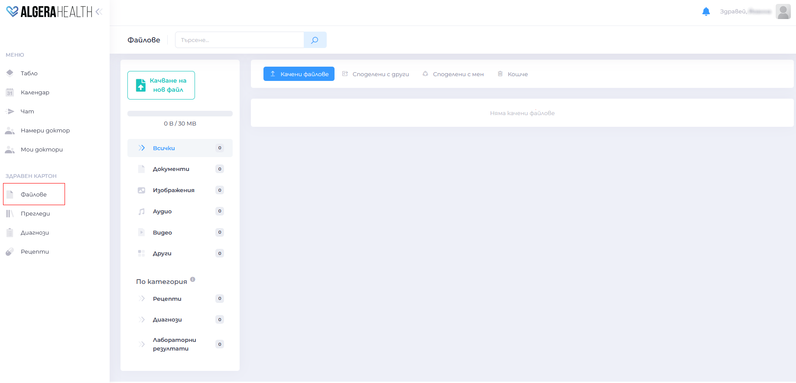
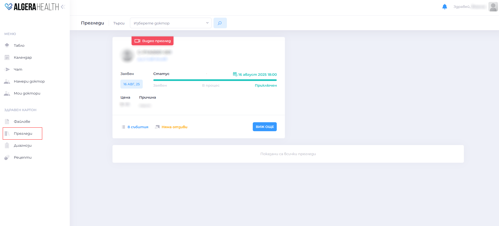
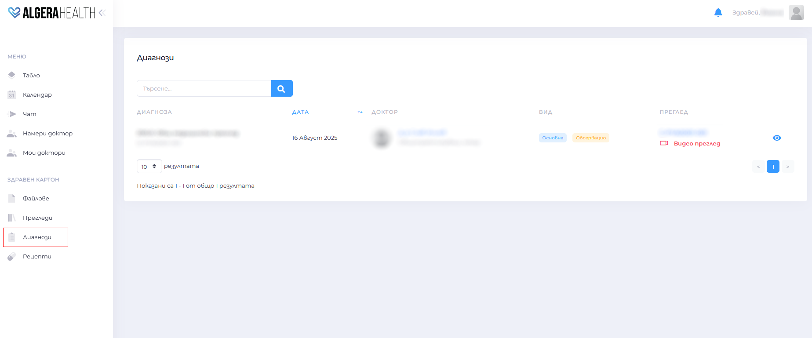
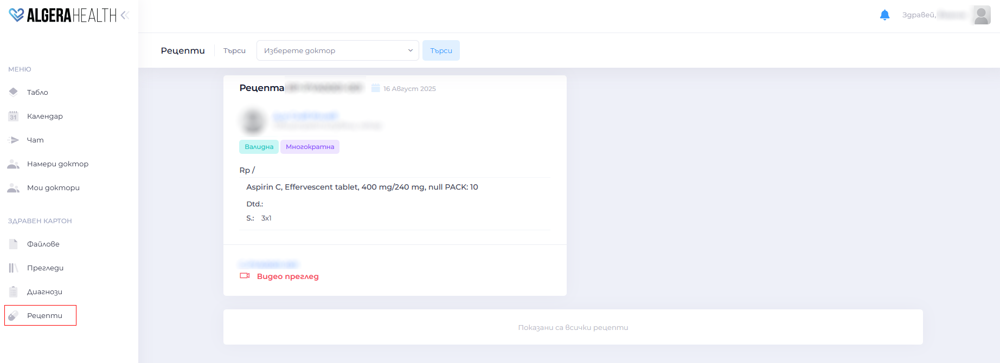

# Здравен картон

Съхранява цялата медицинска информация в дигитален вид.

1. Файлове 
  - Качване и преглед на документи, изследвания и снимки
  

1. Прегледи
  - История на проведените прегледи и заключенията от тях
  

1. Диагнози
  - Списък с поставени диагнози, дата и лекуващ доктор
  

1. Рецепти
  - Преглед на издадени рецепти и инструкции за лечение
  
